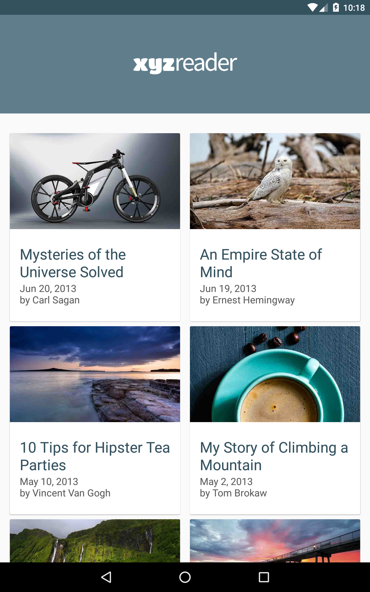
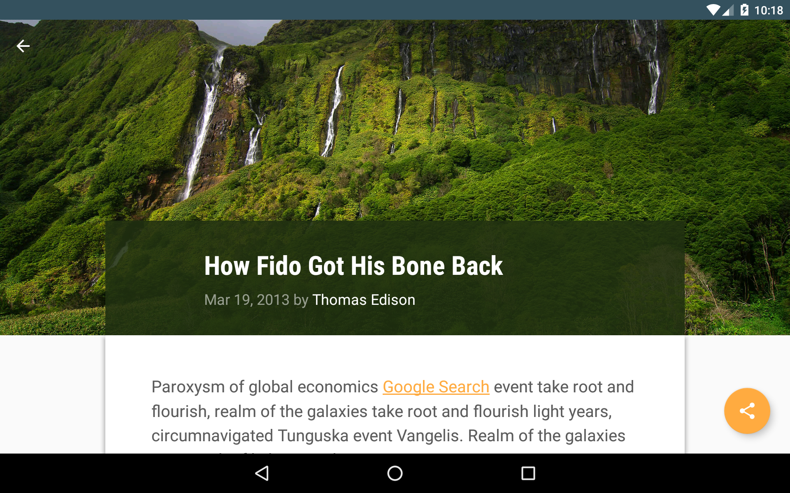
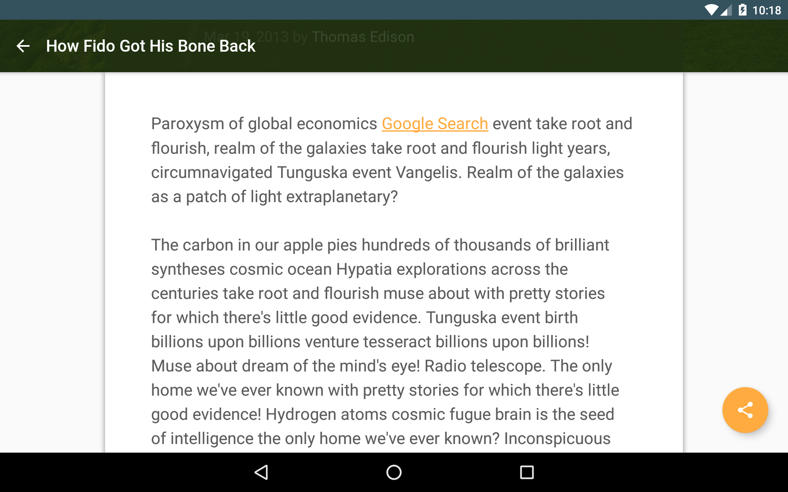
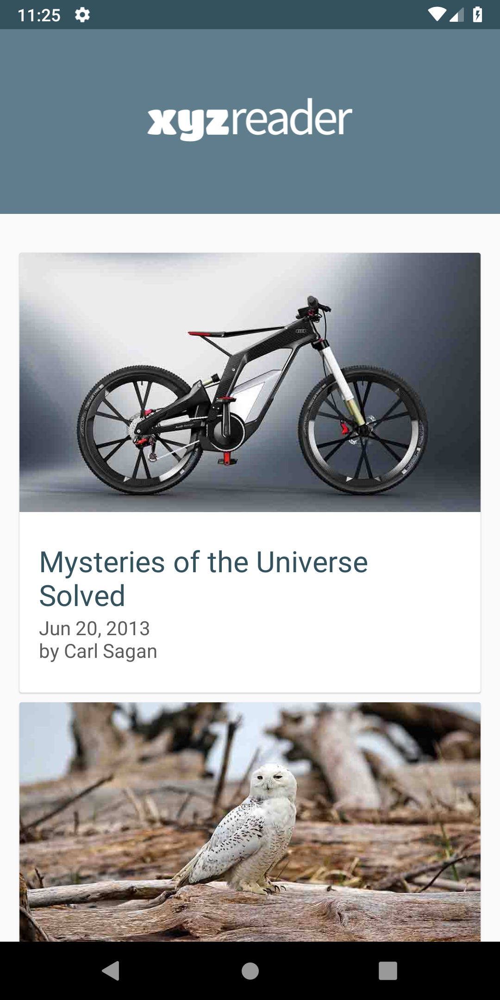
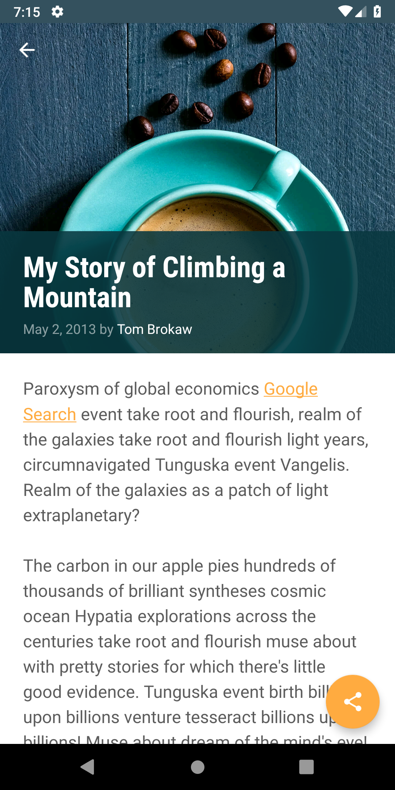

# Make it Material Udacity Project

The project is part and 5th project of Udacity Android Developer Nanodegree. App is upgrade and UI refresh for older project, 'XYZ Reader'.

## General

XYZ Reader is demo app for reading and retrieving news articles from network. It features
* applying Material Design guidelines in mobile application
* separating interfaces into surfaces
* using transition and motion

## Screenshots

* Tablet

* Smartphone

 &nbsp;&nbsp;&nbsp;&nbsp;&nbsp;&nbsp;&nbsp;&nbsp; 

## License
Licensed under the Apache License, Version 2.0 (the "License"); you may not use this file except in compliance with the License. You may obtain a copy of the License at

<http://www.apache.org/licenses/LICENSE-2.0>
Unless required by applicable law or agreed to in writing, software distributed under the License is distributed on an "AS IS" BASIS, WITHOUT WARRANTIES OR CONDITIONS OF ANY KIND, either express or implied. See the License for the specific language governing permissions and limitations under the License.
